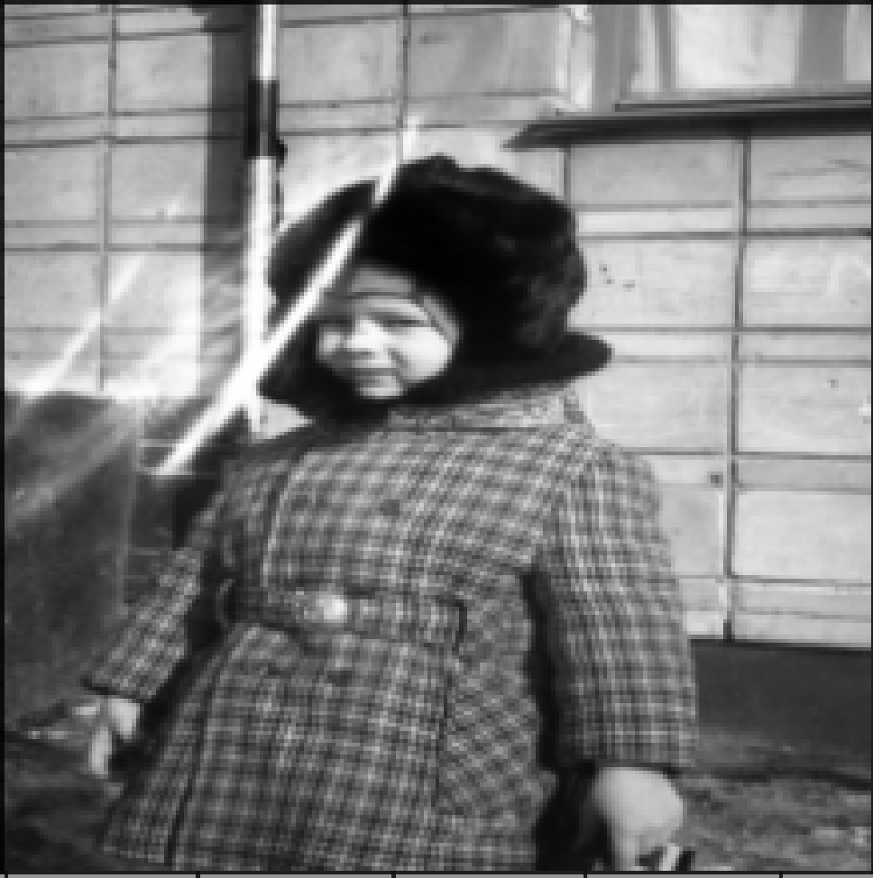
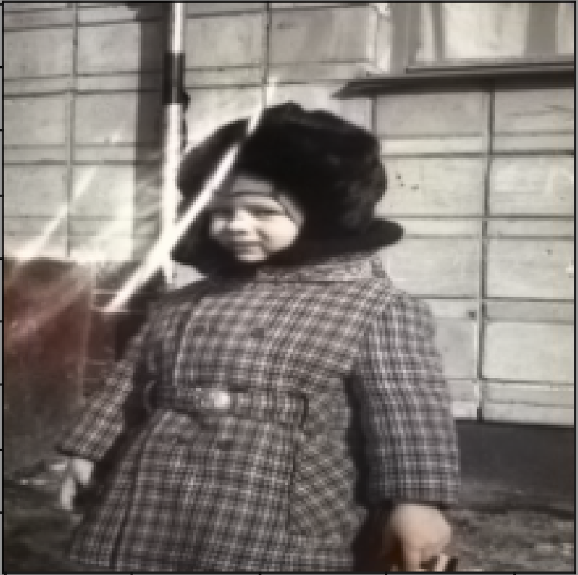
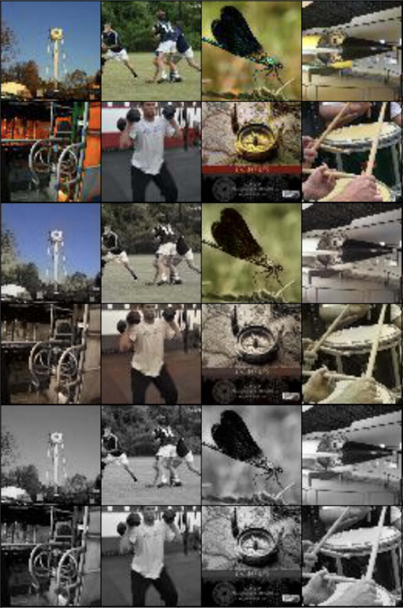

## ChromaGAN Project

This project is based on the paper [ChromaGAN: A Conditional Generative Adversarial Network for Colorization](https://arxiv.org/pdf/1907.09837.pdf) and implements a model for colorizing black and white images. 

### Objective

The goal is to restore the two chrominance channels (a and b) of an image in the CIE Lab color space based on the L channel (luminance).

#### Generated Samples

Colorizing a photograph without ground truth data

  
  

Colorizing test images from TinyImageNet

### Code
Training and inference scripts, along with helper functions, are available in the notebook and the `./scripts` directory.

### Network Architecture

The architecture consists of two main components: the generator and the discriminator. The generator takes as input a three concatenated L-channels of an image and produces two outputs: 

1. The a and b chrominance channels
2. The class distribution of the input images according to ImageNet.

The discriminator receives an image of size HxWx3 in the CIE Lab color space and returns the validity of the generated colorization.

**Detailed Architecture Overview**

The generator takes a black and white image of size 3xL as input. The initial layers replicate the VGG-16 architecture (depicted as yellow blocks), consisting of a sequence of convolutions followed by ReLU activations. After these layers, the outputs split into several block groups:

- **Purple Blocks**: Follows a Conv-BatchNorm-ReLU pattern.
- **Red Blocks**: Contains Conv-BatchNorm-ReLU blocks; the gray section returns the class distribution for ImageNet, while the red section is reshaped to match the purple block size and concatenated with the generator's main flow.

This is followed by upsampling blocks, resulting in two output color channels (a, b). The discriminator, represented by the green part of the diagram, is based on the PatchGAN architecture using 4x4 convolutions, BatchNorm, and LeakyReLU activations.

### Loss Functions

The training objective is the sum of three loss components: 
1. **Color Error Loss** – the L2 norm between the true and generated chrominance channels.
2. **Adversarial Loss with GP** – the Wasserstein GAN loss with gradient penalty.
3. **Class Distribution Loss** – a classifier loss calculated as the KL divergence between the gray outputs of the generator and the predictions from a pre-trained classifier (using VGG-16).

### Model Training

Experiments were logged in Neptune.ai and can be viewed [here](https://ui.neptune.ai/calistro/chromagan/experiments?viewId=standard-view).

While the authors of the paper trained the model on the full ImageNet dataset, I use the smaller `TinyImageNet` dataset for training. To adapt the dataset to this architecture and task, I resized the images to 224x224 (the size used by the pre-trained classifier) and built a correspondence between the 200 classes in TinyImageNet and the 1000 classes in ImageNet.

To generate black and white images from the TinyImageNet dataset, a transformation from RGB to CIE Lab was performed to extract the (L, a, b) channels using the `skimage` library. This transformation was applied to both the generator and discriminator inputs. An inverse transformation from CIE Lab to RGB was also performed for visualizing the generated colorizations during training.

### Experiments

The conducted experiments included:

- Training the generator and discriminator for 3 epochs with a learning rate of 2e-4 (PSNR = 23.5)
- Training with a smaller learning rate of 2e-5 for 4 epochs (PSNR = 24.5)

PSNR was used as a quality metric.

Colorized images from the test set were logged each epoch and can be viewed in the logs under the "colorization" column. 

Additionally, an experiment was conducted to colorize a black and white photograph without ground truth data, which included a comparison with the service provided by Mail.ru at [https://9may.mail.ru/restoration/](https://9may.mail.ru/restoration/).
